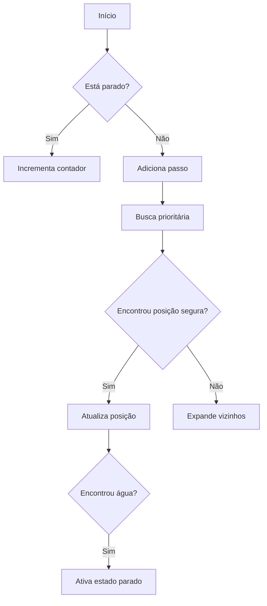
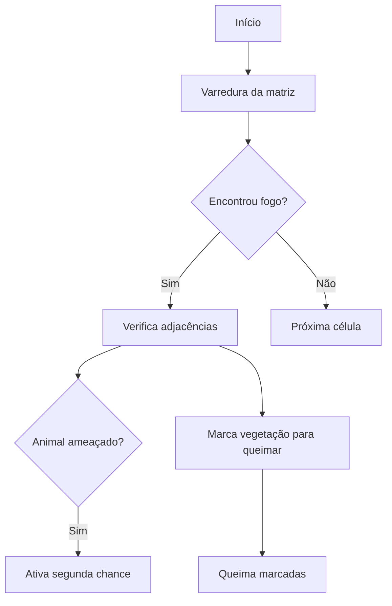
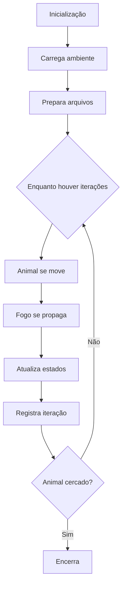

# **🌿🔥 Simulador de Fuga Animal em Incêndio Florestal**  

*Um simulador que modela o comportamento de um animal tentando escapar de um incêndio florestal.*  

---


Créditos da imagem: Robin Tran / via: Artstation

# **Sumário**  

1. [Visão geral](#visão-geral)
2. [Especificação do Problema](#especificação-do-problema) 
3. [Estrutura do código](#estrutura-do-código) 
4. [Classe Config](#classe-config)
5. [Classe Animal](#classe-animal)
6. [Classe Fogo](#classe-fogo)
7. [Classe LeitorArquivo](#classe-leitorarquivo)
8. [Main](#main)
9. [Casos de Teste](#casos-de-teste) 
10. [Conclusão](#conclusão-do-trabalho) 

---  
🔍 *Clique em qualquer título para ir até a seção correspondente.*
## **Visão Geral**  
Este projeto simula a fuga de um animal em um cenário de incêndio florestal, utilizando:  
✔ **Matrizes** para representar o terreno, fogo e caminhos percorridos.  
✔ **Algoritmo de prioridade** para decisões de movimento.  
✔ **Mecânica de propagação de fogo** com diferentes direções de vento.  
✔ **Registro em arquivo** para salvar as informações.  

---

## **Especificação do Problema**  
### **1. Sistema de Movimentação do Animal**  
[Voltar ao sumário](#sumário)
- O animal é inserido na primeira posição segura (`0`) da matriz.
- Prioriza rotas seguras (água > terra > vegetação).  
- Pausa por 3 iterações ao encontrar água, regenerando o ambiente nas posições ortogonais(recebem 1).  
- Marca caminhos percorridos (`8`) apenas na matriz destinada ao percurso do animal (matrizRastro).

### **2. Propagação Dinâmica do Fogo**  
- **5 modos de vento** (sem vento, cima, baixo, esquerda, direita).  
- **Segunda chance**: Se o fogo queimar a posição atual, o animal tenta outra rota.  
- Árvores queimadas (`3`) não pegam fogo novamente.
- O fogo não queima água (`4`).

### **3. Controle por Arquivo**  
- Entrada: Define terreno, posição inicial do fogo e animal.  
- Saída: apaga o que estava previamente no arquivo e gera relatório completo de cada iteração, contendo número de passos, iterações, quanto de água foi encontrado e se o animal está cercado.  

### **4. Exibição da matriz do animal em tempo real**  
- As alterações no ambiente são gravadas no arquivo "output.dat", enquanto o caminhar do animal é exibido no terminal e sua rota percorrida é demercada com (`8`).  


---

### **Arquivos**  
- **`entrada.txt`**: Configuração inicial (formato abaixo).  
- **`saida.txt`**: Resultados da simulação (gerado automaticamente).  

#### **Formato do `entrada.txt`**  
```plaintext
[linhas] [colunas] [posX_fogo] [posY_fogo]
1 1 1 1 4
1 2 1 1 1
2 1 1 1 4
0 2 1 1 1
1 1 1 0 4
# Matriz do terreno
```
**Legenda**:  
- `0`: Terra  
- `1`: Vegetação  
- `2`: Fogo  
- `3`: Árvore queimada  
- `4`: Água  
- `5`: Animal  

---

## **Estrutura do Código** 
[Voltar ao sumário](#sumário)
```plaintext
.
├── main.cpp                  # Loop principal da simulação
├── Animal.hpp/cpp            # Lógica do animal
├── Fogo.hpp/cpp              # Propagação do incêndio
├── LeitorArquivos.hpp/cpp    # Leitura/escrita de arquivos
├── Config.hpp/cpp            # Configuração de parâmetros (ventos, iterações)
├── entrada.txt               # Entrada de dados
└── saida.txt                 # Saída gerada
```

---

## **🎯 Exemplo de Saída**  
```plaintext
Iteração número 5:
3 3 3 3 4 
3 3 3 3 3 
3 3 3 3 4 
0 2 3 2 2 
1 0 2 0 4 
Passos: 3
Encontrou agua: 1
```

---
# **Classe Config**  
*Classe responsável por gerenciar parâmetros de configuração da simulação, como direção do vento e número de iterações.*  

---
[Voltar ao sumário](#sumário)
## **📌 Visão Geral**  
A classe `Config` tem as configuações que controlam o comportamento da simulação:  
- **Direção do vento**: Influencia a propagação do fogo  
- **Número de iterações**: Define a duração máxima da simulação  

---

## **🔧 Funcionalidades**  

### **1. Controle de Vento**  
| Valor | Direção    | Efeito no Fogo                     |  
|-------|------------|-------------------------------------|  
| `0`   | Sem vento  | Propaga igualmente em todas as direções |  
| `1`   | Cima       | Expande unicamente para cima    |  
| `2`   | Direita    | Propaga unicamente para a direita  |  
| `3`   | Baixo      | Fogo avança exclusivamente para baixo              |  
| `4`   | Esquerda   | Propaga exclusivamente à esquerda    |  

### **2. Gerenciamento de Tempo**  
- `iteracoes`: Número máximo de ciclos da simulação  

---

## **📦 Métodos Públicos**  

| Método               | Retorno    | Descrição                          |  
|----------------------|------------|------------------------------------|  
| `getVento()`         | `int`      | Retorna direção atual do vento     |  
| `getIteracoes()`     | `int`      | Retorna total de iterações         |  

---

## **🛠️ Uso Básico**  
- `Como alterar?`: é necessário alterar os valores DENTRO da classe config   

```cpp  
//Config.hpp
class Config {
   private:
    int iteracoes = 10; 
    int vento = 0; 
}

//main
#include "Config.hpp"  

// 1. Inicialização  
Config config;  

// 3. Consulta  
cout << "Vento: " << config.getVento();  
cout << "Iterações: " << config.getIteracoes();  
```

---

## **⚙️ Fluxo de Integração**  
1. **Inicialização**:  
   - Valores padrão: `vento = 0`, `iteracoes = 10`  

2. **Conexão com outras classes**:  
   - `Fogo.hpp`: Usa `getVento()` para determinar padrão de propagação  
   - `main.cpp`: Controla loop principal com `getIteracoes()`  

---

## **📊 Exemplo de Configuração**  
```yaml  
Vento: 2 (Direita)  
Iterações: 200  
```

---

## **📌 Observações**  
- **Validação**: Os métodos não verificam valores inválidos (ex: vento = 99 ou iterações = -6) 

---

# **Classe Animal**  

*Responsável pelo comportamento de fuga do animal em um incêndio florestal, implementando lógica de movimentação baseada em prioridade.*  

---
[Voltar ao sumário](#sumário)

## **📌 Visão Geral**  
A classe `Animal` controla a movimentação de um agente em uma matriz de ambiente, priorizando:  
- **Fuga eficiente** de incêndios  
- **Busca por recursos** (água)  

---

## **🔧 Funcionalidades**  
### **1. Sistema de Prioridades**  
| Valor | Terreno       | Prioridade | Comportamento                          |  
|-------|---------------|------------|----------------------------------------|  
| `4`   | Água          | 5 (Máxima) | Pausa simulação e regenera ambiente    |  
| `0`   | Terra         | 4          | Movimento seguro                       |  
| `1`   | Vegetação     | 3          | Inflamável (risco médio)               |  
| `3`   | Árvore queimada| 2         | Segura, mas baixa prioridade           |  
| `8`   | Caminho       | 1          | Já percorrido (evita loops)            |  

### **2. Mecânicas Especiais**  
- **Florescimento**: Ao encontrar água (`4`), transforma TODAS as adjacências em árvores saudáveis(`1`).  
- **Segunda chance**: Se o fogo atingir células vizinhas, ativa modo de segunda chance, na qual o animal tem mais uma oportunidade de escapar.  
- **Detecção de cerco**: Verifica se está totalmente bloqueado pelo fogo.  

---

## **📦 Métodos Públicos**  

### **Controle de Movimento**  
| Método | Parâmetros | Retorno | Descrição |  
|--------|------------|---------|-----------|  
| `Fugir()` | `matriz`, `matrizRastro` | `void` | Algoritmo principal de busca de caminho |  
| `estaCercado()` | `matrizRastro` | `bool` | Verifica se há rotas de fuga |  

### **Gerenciamento de Estado**  
| Método | Descrição |  
|--------|-----------|  
| `getContaPassos()` | Retorna total de movimentos |  
| `getContaAgua()` | Conta quantas vezes encontrou água |  
| `setSegundaChance()` | Ativa/desativa modo emergência |  

### **Diferenciação das matrizes**  
| matriz | matrizRastro |  
|--------|-----------|  
| Fogo | Fogo |  
| Florescer | Florescer |  
| Árvores queimadas | Árvores queimadas |  
| Animal |  
| Caminho percorrido | 
- **Nota**: O nome `matrizRastro` não é porque ela armazena o rastro do animal (quem faz isso é `matriz`), mas porque ela funciona como um "espelho" da matriz na qual o animal anda. Todas as consequências do percurso do animal são refletidas na matrizRastro, e por isso esse nome.  

### **Utilitários**  
```cpp  
void imprimirMatriz(vector<vector<int>>& matriz);  // Debug visual  
bool ehPosicaoSegura(int valor);                  // Checa segurança  
int obterPrioridade(int valor);                   // Define prioridades  
```

---

## **🛠️ Uso Básico**  
```cpp  
#include "Animal.hpp"  

// 1. Inicialização  
vector<vector<int>> mapa = {{0,1,4}, {2,0,1}};  
Animal animal(mapa);  

// 2. Execução  
vector<vector<int>> rastro = mapa;  
animal.Fugir(mapa, rastro);  

// 3. Consulta resultados  
cout << "Passos: " << animal.getContaPassos();  
```

---

## **⚙️ Fluxo Interno**  
1. **Inicialização**:  
   - Localiza posição inicial (`5`) na matriz.  
   - Configura contadores (passos, água).  

2. **Ciclo de Movimento**:  
   - Usa **fila de prioridade** para explorar células vizinhas.  
   - Atualiza matriz com caminho percorrido (`8`).  

3. **Eventos**:  
   - Encontro com água → Pausa 3 iterações + florescimento.  
   - Fogo adjacente → Ativa `segundaChance`.  
   - Todas as árvores queimaram(ou seja, sem `2` na matriz) → Interrompe a simulação.

---
# **Método Principal: `Fugir()` - Classe Animal**  

*Implementa o algoritmo de busca de caminho prioritário para fuga do animal em ambiente com incêndio.*

---

## **📌 Visão Geral**
Método responsável por:
- **Encontrar rotas seguras** usando busca prioritária 
- **Gerenciar estados especiais** (encontro com água, cercamento)
- **Atualizar matrizes** de ambiente e rastro

---

## **📜 Declaração**
```cpp
void Fugir(vector<vector<int>>& matrizParam, vector<vector<int>>& matrizRastro);
```

| Parâmetro | Tipo | Descrição |
|-----------|------|-----------|
| `matrizParam` | `vector<vector<int>>&` | Matriz que o animal anda |
| `matrizRastro` | `vector<vector<int>>&` | Matriz do ambiente |

---

## **⚙️ Fluxo do Algoritmo**



---

## **🔍 Lógica Detalhada**

### **1. Controle de Estado**
```cpp
if (parado == true && contadorIteracoes != 3) {
    contadorIteracoes++;
    return; // Pausa movimento por 3 iterações
}
```
- Acionado quando o animal encontra água (`4`)
- Permite regeneração do ambiente via `florescerAmbiente()`
- Faz com que o animal fique parado por 3 iterações (tem prioridade sobre `segunda chance`)

### **2. Busca Prioritária**
Componentes principais:
- **Fila de prioridade**: Seleciona sempre a célula mais vantajosa
- **Vetor de visitados**: Evita loops
- **Matriz de origem**: Reconstrução do caminho

```cpp
priority_queue<Celula> fila;
fila.push({posicaoAtual, prioridade});
```

### **3. Avaliação de Células**
```cpp
int prioridade = obterPrioridade(matrizParam[novaLinha][novaColuna]);
```
Prioridades definidas por:
| Valor | Terreno | Prioridade | 
|-------|---------|------------|
| 4 | Água | 5 (Máxima) | 
| 0 | Terra | 4 |
| 1 | Vegetação | 3 | 
| 3 | Árvore queimada | 2 |
| 8 | Caminho anterior | 1 |

### **4. Atualização do Ambiente**
```cpp
matrizParam[novaLinha][novaColuna] = 5; // Nova posição
matrizParam[anterior] = 8; // Marca caminho
```

---

## **⚠️ Tratamento de Casos Especiais**

### **Animal Cercado**
```cpp
if (fila.empty()) {
    // Nenhum caminho válido encontrado
    caminhoEncontrado = false;
}
```

### **Encontro com Água**
```cpp
if (matrizRastro[pos] == 4) {
    addContaAgua();
    parado = true; // Ativa pausa
    florescerAmbiente(...);
}
```

---

## **📊 Estruturas de Dados**

### **Struct `Celula` (Usada na fila)**
```cpp
struct Celula {
    int linha, coluna;
    int prioridade;
    pair<int,int> origem;
    
    // Sobrecarga para comparação
    bool operator<(const Celula& outro) const {
        return prioridade < outro.prioridade;
    }
};
```

### **Matrizes Auxiliares**
| Nome | Tipo | Função |
|------|------|--------|
| `visitado` | `vector<vector<bool>>` | Evita revisitar células |
| `origem` | `vector<vector<pair<int,int>>>` | Registra caminho percorrido |

---


## **🛠️ Exemplo de Uso**
```cpp
Animal animal;
vector<vector<int>> ambiente = leitor.lerArquivo();
vector<vector<int>> rastro = ambiente;

animal.Fugir(ambiente, rastro); // Executa um passo
```
---

## **📌 Observações**  
- **Extensibilidade**: É possível adicionar novos terrenos modificando `obterPrioridade()`.  
   - Não considera movimentos na diagonal

---
# **Classe Fogo**  

*Classe responsável pela simulação da propagação do incêndio florestal com diferentes padrões de propagação baseados em direção do vento.*

---
[Voltar ao sumário](#sumário)

## **🔥 Visão Geral**  
Modela o comportamento do fogo considerando:  
- **5 modos de propagação** (sem vento + 4 direções ortogonais)  
- **Mecânica de atraso** (delay) para simular velocidade realista
- **Interação com o animal** (sistema de segunda chance)  

---

## **⚙️ Métodos Principais**  

### **Controle de Propagação**  
| Método | Parâmetros | Descrição |
|--------|------------|-----------|
| `alastrarFogo*()` | `matriz`, `linhas`, `colunas`, `Animal` | Propaga fogo conforme vento configurado |
| `delayPropagacao()` | `matrizAux`, `linhas`, `colunas` | Introduz atraso na queima |

### **Gerenciamento de Estado**  
| Método | Função |
|--------|--------|
| `transfereFogoMatrizAuxiliar()` | Copia fogo ativo para matriz secundária |
| `alteraEstadoArvoreComFogo()` | Converte árvores queimadas (`2`→`3`) |

### **Interação com Animal**  
- **Segunda chance**: pausa a propagação de fogo por 1 iteração se ele atingir adjacências do animal (`5`), permitindo uma segunda chance . 

---

## **🛠️ Como Usar**  
```cpp
#include "Fogo.hpp"

// 1. Inicialização
Fogo fogo;
vector<vector<int>> matriz(10, vector<int>(10, 1));
matriz[5][5] = 2; // Posição inicial do fogo

// 2. Propagação com vento para direita (modo 2)
fogo.alastrarFogoDireita(matriz, 10, 10, animal);

// 3. Atualização de estados
vector<vector<int>> matrizAux = matriz;
fogo.delayPropagacao(matrizAux, 10, 10);
fogo.alteraEstadoArvoreComFogo(matriz, matrizAux, 10, 10);
```

---

## **⚠️ Mecânicas Especiais**  

### **Sistema de Prioridades**  
1. **Células marcadas com `7`**:  
   - Estado intermediário durante propagação  
   - Convertidas para `2` (fogo ativo) no próximo ciclo  

2. **Proteção ao Animal**:  
   ```cpp
   if (matriz[x+1][y] == 5) animal.setSegundaChance(true);
   ```

---

## **📊 Estrutura de Dados**  
| Matriz | Função |  
|--------|--------|  
| Principal | Ambiente atual |  
| Auxiliar (`matrizAux`) | Controle temporal do fogo |  

---

## **💡 Dicas de Uso**  
- Para simulação realista:  
  ```cpp
  // Configurar vento antes de cada iteração
  switch(config.getVento()) {
      case 1: fogo.alastrarFogoCima(...); break;
      // ...
  }
  ```

---
# **Método `alastrarFogoSemVento()` - Classe Fogo**

*Implementa a propagação do fogo em todas as direções sem influência de vento, com mecanismo de detecção de ameaça ao animal.*

## **🔥 Visão Geral**
Responsável por:
- Propagação do fogo em todas as direções
- Detecção de ameaça ao animal
- Ativação do mecanismo de "segunda chance"
- Queima controlada de vegetação adjacente

## **📜 Assinatura do Método**
```cpp
void alastrarFogoSemVento(
    vector<vector<int>>& matriz, 
    int linha, 
    int coluna, 
    Animal& animal
);
```

| Parâmetro | Tipo | Descrição |
|-----------|------|-----------|
| `matriz` | `vector<vector<int>>&` | Matriz do ambiente |
| `linha` | `int` | Número de linhas da matriz |
| `coluna` | `int` | Número de colunas da matriz |
| `animal` | `Animal&` | Referência ao animal para controle de ameaça |

## **⚙️ Fluxo de Execução**


## **🔍 Lógica Detalhada**

### **1. Detecção de Ameaça ao Animal**
```cpp
if (matriz[x][y] == 2) {
    // Verifica 4 direções cardeais
    if (x+1 < linha && matriz[x+1][y] == 5) animalAmeacado = true;
    ...
}
```
- Ativa o bool `animalAmeacado` se fogo estiver adjacente ao animal (valor 5)
- Propagação imediata da informação via `setSegundaChance(true)`

### **2. Mecanismo de Queima**
```cpp
vector<pair<int, int>> queimar;
...
if (x+1 < linha && matriz[x+1][y] == 1) 
    queimar.push_back({x+1, y});
```
- Armazena posições de vegetação (valor 1) para queima posterior
- Evita modificação imediata da matriz durante varredura

### **3. Padrão de Propagação**
```plaintext
Antes:     Depois:      Próxima:
  1          2             2
1 2 1      2 2 2         2 3 2
  1          2             2
```
- Queima todas as células de vegetação adjacentes
- Mantém outros valores inalterados (água, terra, etc)
- É notável que existem um delay na queima da árvore central, e por isso há o método delayPropagacao

## **⚠️ Tratamento Especial**
### **Segunda Chance**
```cpp
if (animalAmeacado) {
    animal.setSegundaChance(true);
}
```
- Acionado quando fogo atinge:
  - Posição imediatamente acima/abaixo
  - Posição imediatamente aos lados
- Permite ao animal reagir antes da próxima propagação

### **Todas as árvores queimaram?**
-O método verificaFogo analisa se ainda há árvores para serem queimadas e retorna boolean(true, false). Na main, é utilizado para interromper o funcionamento do programa caso não existam mais árvores em chamas.

## **📊 Estruturas de Dados**
| Nome | Tipo | Função |
|------|------|--------|
| `queimar` | `vector<pair<int,int>>` | Refistro de posições para queima |
| `animalAmeacado` | `bool` | Gatilho para acionar estado de 2 chance |

## **🛠️ Exemplo de Uso**
```cpp
Fogo fogo;
Animal animal;
vector<vector<int>> ambiente = {
    {0,1,0},
    {2,0,1},
    {0,1,5}
};

fogo.alastrarFogoSemVento(ambiente, 3, 3, animal);
```

## **📌 Observações**
1. **Não-propagação**:
   - Não queima água (4) ou árvores já queimadas (3)
2. **Segurança**:
   - Verifica limites da matriz antes de cada acesso
3. **Extensibilidade**:
   - Pode ser adaptado para diferentes padrões de propagação

## **📌 Limitações**  
- Não modela:  
  - Fogo em diagonal  
  - Variações de intensidade  
---
# **Classe LeitorArquivo**  

*Classe responsável por gerenciar toda a entrada e saída de dados do sistema, desde a leitura do ambiente inicial até o registro da simulação.*

---
[Voltar ao sumário](#sumário)

## **📂 Visão Geral**
Principais responsabilidades:
- **Leitura** do arquivo de configuração inicial
- **Escrita** do log de simulação passo a passo
- **Validação** básica dos dados de entrada

---

## **📝 Formato do Arquivo de Entrada**
```plaintext
[linhas] [colunas]
[posição_X_fogo] [posição_Y_fogo]
[matriz_do_ambiente...]
```
**Exemplo**:
```plaintext
5 5 1 2
0 1 0 3 4
1 2 0 1 0
0 1 1 0 1
2 0 4 1 0
0 1 0 1 2
```

---

## **🔧 Métodos Públicos**

### **Leitura de Dados**
| Método | Parâmetros | Retorno | Descrição |
|--------|------------|---------|-----------|
| `lerArquivo()` | - | `vector<vector<int>>` | Carrega matriz do ambiente |
| `leX()` | - | `int` | Retorna número de linhas |
| `leY()` | - | `int` | Retorna número de colunas |

### **Saída de Dados**
| Método | Parâmetros | Descrição |
|--------|------------|-----------|
| `escreveArquivo()` | `matriz`, `passos`, `iteracao`, `contaAgua`, `cercado` | Registra estado da simulação |
| `limpaArquivo()` | - | Prepara arquivo de saída |

### **Debug**
| Método | Parâmetros | Descrição |
|--------|------------|-----------|
| `exibeMatriz()` | `vector<vector<char>>` | Exibe matriz formatada no console |

---

## **🛠️ Exemplo de Uso**

```cpp
#include "LeitorArquivos.hpp"

int main() {
    LeitorArquivo leitor;
    
    // 1. Leitura inicial
    vector<vector<int>> ambiente = leitor.lerArquivo();
    
    // 2. Configuração de saída
    leitor.limpaArquivo();
    
    // 3. Durante simulação:
    leitor.escreveArquivo(ambiente, 10, 1, 2, false);
    
    // 4. Debug (opcional)
    vector<vector<char>> debug;
    leitor.exibeMatriz(debug);
}
```

---

## **📌 Detalhes de Implementação**

### **Tratamento de Erros**
- Verifica existência do arquivo
- Valida dimensões da matriz (> 0)

### **Formato de Saída**
Cada registro inclui:
```plaintext
Iteração número X:
[matriz]
Animal cercado (se aplicável)
Passos: Y
Encontrou agua: Z
```

---

# **Main**  

*Classe principal que implementa a leitura de arquivos, a fuga do animal e o incêndio florestal, sendo a principal do sistema.*

---
[Voltar ao sumário](#sumário)

## **📌 Visão Geral**
Este código:
1. **Inicializa** todos os componentes do sistema
2. **Gerencia** o loop principal de simulação
3. **Coordena** as interações entre:
   - Comportamento do animal (`Animal`)
   - Propagação do fogo (`Fogo`)
   - Configurações (`Config`)
   - Entrada/saída (`LeitorArquivo`)

---

## **🔧 Fluxo da Simulação**



---

## **⚙️ Componentes Integrados**

| Classe | Função |
|--------|--------|
| `Animal` | Toma decisões de fuga e marca caminho |
| `Fogo` | Controla propagação conforme vento |
| `Config` | Define iterações e direção do vento |
| `LeitorArquivo` | Gerencia arquivos de entrada/saída |

---

## **📋 Estrutura do Código**

### **1. Inicialização**
```cpp
Config config; 
Fogo fogo;
LeitorArquivo leitorArquivo;
Animal animal;

vector<vector<int>> matriz = leitorArquivo.lerArquivo();
```

### **2. Preparação**
```cpp
leitorArquivo.limpaArquivo();
vector<vector<int>> matrizAuxFogo = matriz; 
vector<vector<int>> matrizRastro = matriz;
```

### **3. Loop Principal**
```cpp
while (cont <= config.getIteracoes()) {
    // Lógica de movimento
    // Propagação do fogo
    // Atualização de estados
}
```

---

## **🔄 Matrizes Principais**

| Nome | Tipo | Função |
|------|------|--------|
| `matriz` | `vector<vector<int>>` | Matriz que o animal percorre |
| `matrizAuxFogo` | `vector<vector<int>>` | Controle auxiliar do fogo |
| `matrizRastro` | `vector<vector<int>>` | Matriz que representa o ambiente sem o animal e suas demarcações |
---

## **⚠️ Condições de Término**

1. **Completar todas as iterações**  
   ```cpp
   cont > config.getIteracoes()
   ```

2. **Animal cercado pelo fogo**  
   ```cpp
   animal2.getCercado() == true
   ```
3. **Caso não haja mais fogo para ser queimado**  

---

**Arquivos necessários**:
- `entrada.txt`: matriz do ambiente (input.dat)
- `saida.txt`: saida com resultados (output.dat)

---

## **💡 Dicas de Desenvolvimento**

1. Para debug:
   ```cpp
   animal2.imprimirMatriz(matriz); // Exibe estado da matriz o qual o animal anda
   ```
- **Exibição**: o método imprimirMatriz exibe a matriz com o animal e seu caminho, a partir da iteração 0 (ou seja, ele reexibe a entrada com o animal adicionado). Sendo assim, seu número de iterações exibidas é sempre 1 unidade a mais que do que as de output.dat.
---
# **Casos de Teste** 
[Voltar ao sumário](#sumário)

1. **Exemplo 1**  
   -Justificativa: matriz previamente estabelecida no documento de instrução do trabalho
   
   -Configuração: vento=0, iteracao=10
   
   ```cpp
   //input.dat
      5 5 1 1
      1 1 1 1 4
      1 2 1 1 1
      1 1 1 1 4
      0 0 1 1 1
      1 4 1 0 4
   ```
   ```cpp
   //output.dat
      Iteração número 1:
      1 2 1 1 4 
      2 2 2 1 1 
      1 2 1 1 4 
      0 0 1 1 1 
      1 4 1 0 4 
      Passos: 1
      Encontrou agua: 0

      Iteração número 2:
      2 2 2 1 4 
      2 3 2 2 1 
      2 2 2 1 4 
      0 0 1 1 1 
      1 4 1 0 4 
      Passos: 2
      Encontrou agua: 0

      Iteração número 3:
      2 3 2 2 4 
      3 3 3 2 2 
      2 3 2 2 4 
      0 1 2 1 1 
      1 0 1 0 4 
      Passos: 3
      Encontrou agua: 1

      Iteração número 4:
      3 3 3 2 4 
      3 3 3 3 2 
      3 3 3 2 4 
      0 2 2 2 1 
      1 0 2 0 4 
      Passos: 3
      Encontrou agua: 1

      Iteração número 5:
      3 3 3 3 4 
      3 3 3 3 3 
      3 3 3 3 4 
      0 2 3 2 2 
      1 0 2 0 4 
      Passos: 3
      Encontrou agua: 1

      Iteração número 6:
      3 3 3 3 4 
      3 3 3 3 3 
      3 3 3 3 4 
      0 3 3 3 2 
      1 0 3 0 4 
      Passos: 3
      Encontrou agua: 1

      Iteração número 7:
      3 3 3 3 4 
      3 3 3 3 3 
      3 3 3 3 4 
      0 3 3 3 3 
      1 0 3 0 4 
      Passos: 4
      Encontrou agua: 1

   ```
   ```cpp
   //animal2.imprimirMatriz(matriz);
      1 1 1 1 4 
      1 2 1 1 1 
      1 1 1 1 4   
      5 0 1 1 1 
      1 4 1 0 4 

      1 2 1 1 4 
      2 2 2 1 1 
      1 2 1 1 4 
      8 5 1 1 1 
      1 4 1 0 4 

      2 2 2 1 4 
      2 3 2 2 1 
      2 2 2 1 4 
      8 8 1 1 1 
      1 5 1 0 4 

      2 3 2 2 4 
      3 3 3 2 2 
      2 3 2 2 4 
      8 8 2 1 1 
      1 5 1 0 4 

      3 3 3 2 4 
      3 3 3 3 2 
      3 3 3 2 4 
      8 8 2 2 1 
      1 5 2 0 4 

      3 3 3 3 4 
      3 3 3 3 3 
      3 3 3 3 4 
      8 8 3 2 2 
      1 5 2 0 4 

      3 3 3 3 4 
      3 3 3 3 3 
      3 3 3 3 4 
      8 3 3 3 2 
      5 8 3 0 4 

      3 3 3 3 4 
      3 3 3 3 3 
      3 3 3 3 4 
      5 3 3 3 3 
      8 8 3 0 4 
      
      //funcionamento interrompido devido a ausência de fogo
   ```
2. **Exemplo 2**  
   -Justificativa: análise de prefências do animal em um ambiente com o mesmo tipo de terreno(1)
   
   -Configuração: vento=0, iteracao=30
   ```cpp
      //input.dat
      7 7 2 1
      1 1 1 1 1 1 1
      1 1 1 1 1 1 1
      1 1 1 1 1 1 1
      1 1 1 0 1 1 1
      1 1 1 1 1 1 1
      1 1 1 1 1 1 1
      1 1 1 1 1 1 2
       
      ```
        
   ```cpp
      //output.dat
      Iteração número 1:
      1 1 1 1 1 1 1 
      1 1 1 1 1 1 1 
      1 1 1 1 1 1 1 
      1 1 1 0 1 1 1 
      1 1 1 1 1 1 1 
      1 1 1 1 1 1 2 
      1 1 1 1 1 2 2 
      Passos: 1
      Encontrou agua: 0

      Iteração número 2:
      1 1 1 1 1 1 1 
      1 1 1 1 1 1 1 
      1 1 1 1 1 1 1 
      1 1 1 0 1 1 1 
      1 1 1 1 1 1 2 
      1 1 1 1 1 2 2 
      1 1 1 1 2 2 3 
      Passos: 2
      Encontrou agua: 0

      Iteração número 3:
      1 1 1 1 1 1 1 
      1 1 1 1 1 1 1 
      1 1 1 1 1 1 1 
      1 1 1 0 1 1 2 
      1 1 1 1 1 2 2 
      1 1 1 1 2 2 3 
      1 1 1 2 2 3 3 
      Passos: 3
      Encontrou agua: 0

      Iteração número 4:
      1 1 1 1 1 1 1 
      1 1 1 1 1 1 1 
      1 1 1 1 1 1 2 
      1 1 1 0 1 2 2 
      1 1 1 1 2 2 3 
      1 1 1 2 2 3 3 
      1 1 2 2 3 3 3 
      Passos: 4
      Encontrou agua: 0

      Iteração número 5:
      1 1 1 1 1 1 1 
      1 1 1 1 1 1 2 
      1 1 1 1 1 2 2 
      1 1 1 0 2 2 3 
      1 1 1 2 2 3 3 
      1 1 2 2 3 3 3 
      1 2 2 3 3 3 3 
      Passos: 5
      Encontrou agua: 0

      Iteração número 6:
      1 1 1 1 1 1 2 
      1 1 1 1 1 2 2 
      1 1 1 1 2 2 3 
      1 1 1 0 2 3 3 
      1 1 2 2 3 3 3 
      1 2 2 3 3 3 3 
      2 2 3 3 3 3 3 
      Passos: 6
      Encontrou agua: 0

      Iteração número 7:
      1 1 1 1 1 2 2 
      1 1 1 1 2 2 3 
      1 1 1 2 2 3 3 
      1 1 2 0 3 3 3 
      1 2 2 3 3 3 3 
      2 2 3 3 3 3 3 
      2 3 3 3 3 3 3 
      Passos: 7
      Encontrou agua: 0

      Iteração número 8:
      1 1 1 1 2 2 3 
      1 1 1 2 2 3 3 
      1 1 2 2 3 3 3 
      1 2 2 0 3 3 3 
      2 2 3 3 3 3 3 
      2 3 3 3 3 3 3 
      3 3 3 3 3 3 3 
      Passos: 8
      Encontrou agua: 0

      Iteração número 9:
      1 1 1 2 2 3 3 
      1 1 2 2 3 3 3 
      1 2 2 3 3 3 3 
      2 2 3 0 3 3 3 
      2 3 3 3 3 3 3 
      3 3 3 3 3 3 3 
      3 3 3 3 3 3 3 
      Passos: 9
      Encontrou agua: 0

      Iteração número 10:
      1 1 2 2 3 3 3 
      1 2 2 3 3 3 3 
      2 2 3 3 3 3 3 
      2 3 3 0 3 3 3 
      3 3 3 3 3 3 3 
      3 3 3 3 3 3 3 
      3 3 3 3 3 3 3 
      Passos: 10
      Encontrou agua: 0

      Iteração número 11:
      1 2 2 3 3 3 3 
      2 2 3 3 3 3 3 
      2 3 3 3 3 3 3 
      3 3 3 0 3 3 3 
      3 3 3 3 3 3 3 
      3 3 3 3 3 3 3 
      3 3 3 3 3 3 3 
      Animal cercado.
      Passos: 11
      Encontrou agua: 0
      //fim da simulação
      ```

   ```cpp
      //print
      1 1 1 1 1 1 1 
      1 1 1 1 1 1 1 
      1 1 1 1 1 1 1 
      1 1 1 5 1 1 1 
      1 1 1 1 1 1 1 
      1 1 1 1 1 1 1 
      1 1 1 1 1 1 2 

      1 1 1 1 1 1 1 
      1 1 1 1 1 1 1 
      1 1 1 5 1 1 1 
      1 1 1 8 1 1 1 
      1 1 1 1 1 1 1 
      1 1 1 1 1 1 2 
      1 1 1 1 1 2 2 

      1 1 1 1 1 1 1 
      1 1 1 5 1 1 1 
      1 1 1 8 1 1 1 
      1 1 1 8 1 1 1 
      1 1 1 1 1 1 2 
      1 1 1 1 1 2 2 
      1 1 1 1 2 2 3 

      1 1 1 5 1 1 1 
      1 1 1 8 1 1 1 
      1 1 1 8 1 1 1 
      1 1 1 8 1 1 2 
      1 1 1 1 1 2 2 
      1 1 1 1 2 2 3 
      1 1 1 2 2 3 3 

      1 1 5 8 1 1 1 
      1 1 1 8 1 1 1 
      1 1 1 8 1 1 2 
      1 1 1 8 1 2 2 
      1 1 1 1 2 2 3 
      1 1 1 2 2 3 3 
      1 1 2 2 3 3 3 

      1 1 8 8 1 1 1 
      1 1 5 8 1 1 2 
      1 1 1 8 1 2 2 
      1 1 1 8 2 2 3 
      1 1 1 2 2 3 3 
      1 1 2 2 3 3 3 
      1 2 2 3 3 3 3 

      1 1 8 8 1 1 2 
      1 1 8 8 1 2 2 
      1 1 5 8 2 2 3 
      1 1 1 8 2 3 3 
      1 1 2 2 3 3 3 
      1 2 2 3 3 3 3 
      2 2 3 3 3 3 3 

      1 1 8 8 1 2 2 
      1 1 8 8 2 2 3 
      1 5 8 8 2 3 3 
      1 1 2 8 3 3 3 
      1 2 2 3 3 3 3 
      2 2 3 3 3 3 3 
      2 3 3 3 3 3 3 

      1 1 8 8 2 2 3 
      1 5 8 8 2 3 3 
      1 8 8 8 3 3 3 
      1 2 2 8 3 3 3 
      2 2 3 3 3 3 3 
      2 3 3 3 3 3 3 
      3 3 3 3 3 3 3 

      1 5 8 8 2 3 3 
      1 8 8 8 3 3 3 
      1 8 8 3 3 3 3 
      2 2 3 8 3 3 3 
      2 3 3 3 3 3 3 
      3 3 3 3 3 3 3 
      3 3 3 3 3 3 3 

      5 8 8 8 3 3 3 
      1 8 8 3 3 3 3 
      2 8 3 3 3 3 3 
      2 3 3 8 3 3 3 
      3 3 3 3 3 3 3 
      3 3 3 3 3 3 3 
      3 3 3 3 3 3 3 

      5 8 8 3 3 3 3 
      2 8 3 3 3 3 3 
      2 3 3 3 3 3 3 
      3 3 3 8 3 3 3 
      3 3 3 3 3 3 3 
      3 3 3 3 3 3 3 
      3 3 3 3 3 3 3 
      
      ```
   **Nota**: Observa-se que o animal priorizou cima -> esquerda -> baixo
3. **Exemplo 3**  
   -Justificativa: matriz que demonstra a prioridade de escolha segura do animal e a propagação correta do fogo

   -Configuração: vento=0, iteracao=10
   
   ```cpp
   //input.dat
      5 5 1 1
      2 1 1 1 4
      0 0 0 0 1
      0 0 0 0 1
      0 0 0 0 1
      2 1 1 1 1
   ```
   ```cpp
      Iteração número 1:
      2 2 1 1 4 
      0 0 0 0 1 
      0 0 0 0 1 
      0 0 0 0 1 
      2 2 1 1 1 
      Passos: 1
      Encontrou agua: 0

      Iteração número 2:
      3 2 2 1 4 
      0 0 0 0 1 
      0 0 0 0 1 
      0 0 0 0 1 
      3 2 2 1 1 
      Passos: 2
      Encontrou agua: 0

      Iteração número 3:
      3 3 2 2 4 
      0 0 0 0 1 
      0 0 0 0 1 
      0 0 0 0 1 
      3 3 2 2 1 
      Passos: 3
      Encontrou agua: 0

      Iteração número 4:
      3 3 3 2 4 
      0 0 0 0 1 
      0 0 0 0 1 
      0 0 0 0 1 
      3 3 3 2 2 
      Passos: 4
      Encontrou agua: 0

      Iteração número 5:
      3 3 3 3 4 
      0 0 0 0 1 
      0 0 0 0 1 
      0 0 0 0 2 
      3 3 3 3 2 
      Passos: 5
      Encontrou agua: 0

      Iteração número 6:
      3 3 3 3 4 
      0 0 0 0 1 
      0 0 0 0 2 
      0 0 0 0 2 
      3 3 3 3 3 
      Passos: 6
      Encontrou agua: 0

      Iteração número 7:
      3 3 3 3 4 
      0 0 0 0 2 
      0 0 0 0 2 
      0 0 0 0 3 
      3 3 3 3 3 
      Passos: 7
      Encontrou agua: 0

      Iteração número 8:
      3 3 3 3 4 
      0 0 0 0 2 
      0 0 0 0 3 
      0 0 0 0 3 
      3 3 3 3 3 
      Passos: 8
      Encontrou agua: 0

      Iteração número 9:
      3 3 3 3 4 
      0 0 0 0 3 
      0 0 0 0 3 
      0 0 0 0 3 
      3 3 3 3 3 
      Passos: 9
      Encontrou agua: 0
      //termino do incêndio
      ```
   ```cpp
   //animal2.imprimirMatriz(matriz);
      2 1 1 1 4 
      5 0 0 0 1 
      0 0 0 0 1 
      0 0 0 0 1 
      2 1 1 1 1 

      2 2 1 1 4 
      8 0 0 0 1 
      5 0 0 0 1 
      0 0 0 0 1 
      2 2 1 1 1 

      3 2 2 1 4 
      8 0 0 0 1 
      8 0 0 0 1 
      5 0 0 0 1 
      3 2 2 1 1 

      3 3 2 2 4 
      8 0 0 0 1 
      8 0 0 0 1 
      8 5 0 0 1 
      3 3 2 2 1 

      3 3 3 2 4 
      8 0 0 0 1 
      8 5 0 0 1 
      8 8 0 0 1 
      3 3 3 2 2 

      3 3 3 3 4 
      8 5 0 0 1 
      8 8 0 0 1 
      8 8 0 0 2 
      3 3 3 3 2 

      3 3 3 3 4 
      8 8 5 0 1 
      8 8 0 0 2 
      8 8 0 0 2 
      3 3 3 3 3 

      3 3 3 3 4 
      8 8 8 0 2 
      8 8 5 0 2 
      8 8 0 0 3 
      3 3 3 3 3 

      3 3 3 3 4 
      8 8 8 0 2 
      8 8 8 0 3 
      8 8 5 0 3 
      3 3 3 3 3 

      3 3 3 3 4 
      8 8 8 0 3 
      8 8 8 0 3 
      8 8 8 5 3 
      3 3 3 3 3 
   ```


---

## **🛠️ Como Usar**  

### **Compilador**  
- Compilador C++ (ex: `g++`).  

### **Compilação e Execução**  
```bash
# Limpar
make clean

# Compilar e Rodar
make
```

---
## **Conclusão do Trabalho**  
[Voltar ao sumário](#sumário)

O **simulador de fuga animal em incêndio florestal** desenvolvido cumpre com êxito suas especificações principais, demonstrando:  

✅ **Comportamento coerente do animal**, com um sistema de prioridades eficiente para busca de rotas seguras (água, terra, vegetação) e que funciona corretamente.  

✅ **Propagação do fogo**, considerando diferentes padrões de vento e interações com o terreno.  

✅ **Favorecimento da fuga do animal**, com a "segunda chance" quando o fogo se aproxima do animal.  

✅ **Registro** da simulação em arquivo, permitindo análise.  

✅ **Estrutura organizada**, com classes bem definidas (`Animal`, `Fogo`, `LeitorArquivo`, `Config`), facilitando manutenção e extensão.  

### **Resultados Coerentes**  
Os testes realizados comprovam que o sistema:  
- Gera **cenários coerentes** com diferentes configurações de vento e terreno.  
- Mantém **consistência** mesmo em matrizes grandes (até 100x100).  
- Fornece **dados úteis** para estudo de padrões de fuga e propagação de incêndios.  

## **📌 Limitações Conhecidas**
- Não suporta redimensionamento do ambiente (aumento ou diminuição da matriz por algum motivo)
- Vento diagonal não implementado
- Visualização em tempo real limitada
- Por vezes, o delay de propagação do fogo e florescer ambiente entram em conflito por motivos desconhecidos. Isso pode gerar resultados inconsistentes em raras ocasiões.

### **Possíveis Melhorias**  
Apesar dos resultados satisfatórios, o trabalho pode ser aprimorado com:  

🔧 **Adição de movimentos diagonais** (tanto para o animal quanto para o fogo), aumentando as possibilidades de movimentação.  

🔧 **Visualização facilitada** com uso de emojis no lugar de inteiros para melhor acompanhamento.  

🔧 **Otimização de desempenho** , uma vez que o algoritmo não foi desenvolvido com o propósito de ser o mais eficiente .  

🔧 **Novos terrenos e obstáculos**, como pedras ou rios, adicionando novas variáveis para a interação com o animal.  

### **Considerações Finais**  
Este projeto serve como **base sólida** para simulação do comportamento do animal e do incêndio. Embora já atenda aos requisitos propostos, as melhorias sugeridas podem transformá-lo em uma ferramenta ainda mais eficaz e fácil utilizar. 


**Desenvolvido por William Leão** - 👽