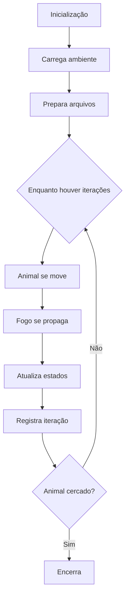

# **🌿🔥 Simulador de Fuga Animal em Incêndio Florestal**  

*Um simulador que modela o comportamento de um animal tentando escapar de um incêndio florestal em um ambiente dinâmico.*  

---

## **📌 Visão Gera**  
Este projeto simula a fuga de um animal em um cenário de incêndio florestal, utilizando:  
✔ **Matrizes** para representar o terreno, fogo e caminhos percorridos.  
✔ **Algoritmo de prioridade** para decisões de movimento.  
✔ **Mecânica de propagação de fogo** com diferentes direções de vento.  
✔ **Registro em arquivo** para análise detalhada.  

---

## **🚀 Especificação do Problema**  
### **1. Sistema de Movimentação do Animal**  
- O animal é inserido na primeira posição segura (`0`) da matriz.
- Prioriza rotas seguras (água > terra > vegetação).  
- Pausa por 3 iterações ao encontrar água, regenerando o ambiente nas posições ortogonais(recebem 1).  
- Marca caminhos percorridos (`8`) apenas na matriz destinada ao percurso do animal (matrizRastro).

### **2. Propagação Dinâmica do Fogo**  
- **5 modos de vento** (sem vento, cima, baixo, esquerda, direita).  
- **Segunda chance**: Se o fogo queimar a posição atual, o animal tenta uma rota alternativa.  
- Árvores queimadas (`3`) não pegam fogo novamente.
- O fogo não queima água (`4`).

### **3. Controle por Arquivo**  
- Entrada: Define terreno, posição inicial do fogo e animal.  
- Saída: apaga o que estava previamente no arquivo e gera relatório completo de cada iteração, contendo número de passos, iterações, quanto de água foi encontrado e se o animal está cercado.  

---

## **🛠️ Como Usar**  

### **Pré-requisitos**  
- Compilador C++ (ex: `g++`).  

### **Compilação e Execução**  
```bash
# Limpar
make clear

# Compilar e Rodar
make
```

### **Arquivos**  
- **`entrada.txt`**: Configuração inicial (formato abaixo).  
- **`saida.txt`**: Resultados da simulação (gerado automaticamente).  

#### **Formato do `entrada.txt`**  
```plaintext
[linhas] [colunas] [posX_fogo] [posY_fogo]
1 1 1 1 4
1 2 1 1 1
2 1 1 1 4
0 2 1 1 1
1 1 1 0 4
# Matriz do terreno
```
**Legenda**:  
- `0`: Terra  
- `1`: Vegetação  
- `2`: Fogo  
- `3`: Árvore queimada  
- `4`: Água  
- `5`: Animal  

---

## **📂 Estrutura do Código**  
```plaintext
.
├── main.cpp                  # Loop principal da simulação
├── Animal.hpp/cpp            # Lógica do animal
├── Fogo.hpp/cpp              # Propagação do incêndio
├── LeitorArquivos.hpp/cpp    # Leitura/escrita de arquivos
├── Config.hpp/cpp            # Configuração de parâmetros (ventos, iterações)
├── entrada.txt               # Entrada de dados
└── saida.txt                 # Saída gerada
```

---

## **🎯 Exemplo de Saída**  
```plaintext
Iteração número 5:
0 1 5 3 4 ...
1 2 0 8 1 ...
Passos: 12
Encontrou agua: 2
Animal cercado.  # Se aplicável
```

---
# **Classe Config**  
*Classe responsável por gerenciar parâmetros de configuração da simulação, como direção do vento e número de iterações.*  

---

## **📌 Visão Geral**  
A classe `Config` centraliza os ajustes que controlam o comportamento da simulação:  
- **Direção do vento**: Influencia a propagação do fogo  
- **Número de iterações**: Define a duração máxima da simulação  
- **Extensível**: Pode ser modificada para incluir novos parâmetros  

---

## **🔧 Funcionalidades**  

### **1. Controle de Vento**  
| Valor | Direção    | Efeito no Fogo                     |  
|-------|------------|-------------------------------------|  
| `0`   | Sem vento  | Propaga igualmente em todas as direções |  
| `1`   | Cima       | Expande principalmente para cima    |  
| `2`   | Direita    | Propaga mais rápido para a direita  |  
| `3`   | Baixo      | Fogo avança para baixo              |  
| `4`   | Esquerda   | Tendência de propagar à esquerda    |  

### **2. Gerenciamento de Tempo**  
- `iteracoes`: Número máximo de ciclos da simulação  

---

## **📦 Métodos Públicos**  

| Método               | Retorno    | Descrição                          |  
|----------------------|------------|------------------------------------|  
| `getVento()`         | `int`      | Retorna direção atual do vento     |  
| `setVento(int)`      | `void`     | Altera direção do vento (0-4)      |  
| `getIteracoes()`     | `int`      | Retorna total de iterações         |  
| `setIteracoes(int)`  | `void`     | Define duração da simulação        |  

---

## **🛠️ Uso Básico**  

```cpp  
#include "Config.hpp"  

// 1. Inicialização  
Config config;  

// 2. Configuração  
config.setVento(2);  // Vento para direita  
config.setIteracoes(100);  

// 3. Consulta  
cout << "Vento: " << config.getVento();  
cout << "Iterações: " << config.getIteracoes();  
```

---

## **⚙️ Fluxo de Integração**  
1. **Inicialização**:  
   - Valores padrão: `vento = 0`, `iteracoes = 50`  

2. **Conexão com outras classes**:  
   - `Fogo.hpp`: Usa `getVento()` para determinar padrão de propagação  
   - `main.cpp`: Controla loop principal com `getIteracoes()`  

---

## **📊 Exemplo de Configuração**  
```yaml  
# Configuração sugerida para teste  
Vento: 2 (Direita)  
Iterações: 200  
```

---

## **📌 Observações**  
- **Validação**: Os métodos não verificam valores inválidos (ex: vento = 99)  
- **Extensibilidade**: Pode ser expandida para incluir:  
  - Umidade do ar  
  - Intensidade do fogo  
  - Dificuldade de movimento  

---

# **Classe Animal**  

*Responsável pelo comportamento de fuga do animal em um incêndio florestal, implementando lógica de movimentação inteligente baseada em prioridades de terreno.*  

---

## **📌 Visão Geral**  
A classe `Animal` controla a movimentação de um agente em uma matriz de ambiente, priorizando:  
- **Fuga eficiente** de incêndios  
- **Busca por recursos** (água)  
- **Evitação de obstáculos** (fogo, terrenos perigosos)  

---

## **🔧 Funcionalidades**  
### **1. Sistema de Prioridades**  
| Valor | Terreno       | Prioridade | Comportamento                          |  
|-------|---------------|------------|----------------------------------------|  
| `4`   | Água          | 5 (Máxima) | Pausa simulação e regenera ambiente    |  
| `0`   | Terra         | 4          | Movimento seguro                       |  
| `1`   | Vegetação     | 3          | Inflamável (risco médio)               |  
| `3`   | Árvore queimada| 2         | Segura, mas baixa prioridade           |  
| `8`   | Caminho       | 1          | Já percorrido (evita loops)            |  

### **2. Mecânicas Especiais**  
- **Florescimento**: Ao encontrar água (`4`), transforma adjacências em terra segura (`0`).  
- **Segunda chance**: Se o fogo atingir células vizinhas, ativa modo de emergência.  
- **Detecção de cerco**: Verifica se está totalmente bloqueado pelo fogo.  

---

## **📦 Métodos Públicos**  

### **Controle de Movimento**  
| Método | Parâmetros | Retorno | Descrição |  
|--------|------------|---------|-----------|  
| `Fugir()` | `matriz`, `matrizRastro` | `void` | Algoritmo principal de busca de caminho |  
| `estaCercado()` | `matrizRastro` | `bool` | Verifica se há rotas de fuga |  

### **Gerenciamento de Estado**  
| Método | Descrição |  
|--------|-----------|  
| `getContaPassos()` | Retorna total de movimentos |  
| `getContaAgua()` | Conta quantas vezes encontrou água |  
| `setSegundaChance()` | Ativa/desativa modo emergência |  

### **Utilitários**  
```cpp  
void imprimirMatriz(vector<vector<int>>& matriz);  // Debug visual  
bool ehPosicaoSegura(int valor);                  // Checa segurança  
int obterPrioridade(int valor);                   // Define prioridades  
```

---

## **🛠️ Uso Básico**  
```cpp  
#include "Animal.hpp"  

// 1. Inicialização  
vector<vector<int>> mapa = {{0,1,4}, {2,0,1}};  
Animal animal(mapa);  

// 2. Execução  
vector<vector<int>> rastro = mapa;  
animal.Fugir(mapa, rastro);  

// 3. Consulta resultados  
cout << "Passos: " << animal.getContaPassos();  
```

---

## **⚙️ Fluxo Interno**  
1. **Inicialização**:  
   - Localiza posição inicial (`5`) na matriz.  
   - Configura contadores (passos, água).  

2. **Ciclo de Movimento**:  
   - Usa **fila de prioridade** para explorar células vizinhas.  
   - Atualiza matriz com caminho percorrido (`8`).  

3. **Eventos**:  
   - Encontro com água → Pausa 2 iterações + florescimento.  
   - Fogo adjacente → Ativa `segundaChance`.  

---

## **📊 Exemplo de Saída**  
```plaintext  
Matriz Atual:  
0 1 5  
2 8 4  
Passos: 3 | Água: 1  
```  

---

## **📌 Observações**  
- **Eficiência**: Algoritmo ótimo para matrizes até 100x100.  
- **Extensibilidade**: Adicione novos terrenos modificando `obterPrioridade()`.  

---
# **Classe Fogo**  

*Classe responsável pela simulação da propagação do incêndio florestal com diferentes padrões de alastramento baseados em direção do vento.*

---

## **🔥 Visão Geral**  
Modela o comportamento do fogo considerando:  
- **5 modos de propagação** (sem vento + 4 direções cardeais)  
- **Mecânica de atraso** (delay) para simular velocidade realista  
- **Interação com o animal** (sistema de segunda chance)  

---

## **🌪️ Sistema de Ventos**  
| Valor | Método                  | Efeito                           |
|-------|-------------------------|----------------------------------|
| `0`   | `alastrarFogoSemVento()`| Propaga em todas as direções     |  
| `1`   | `alastrarFogoCima()`    | Expansão preferencial para cima  |
| `2`   | `alastrarFogoDireita()` | Fogo avança mais à direita       |
| `3`   | `alastrarFogoBaixo()`   | Propagação acelerada para baixo  |
| `4`   | `alastrarFogoEsquerda()`| Tendência forte à esquerda       |

---

## **⚙️ Métodos Principais**  

### **Controle de Propagação**  
| Método | Parâmetros | Descrição |
|--------|------------|-----------|
| `alastrarFogo*()` | `matriz`, `linhas`, `colunas`, `Animal` | Propaga fogo conforme vento configurado |
| `delayPropagacao()` | `matrizAux`, `linhas`, `colunas` | Introduz atraso na queima |

### **Gerenciamento de Estado**  
| Método | Função |
|--------|--------|
| `transfereFogoMatrizAuxiliar()` | Copia fogo ativo para matriz secundária |
| `alteraEstadoArvoreComFogo()` | Converte árvores queimadas (`2`→`3`) |

### **Interação com Animal**  
- **Segunda chance**: Bloqueia propagação se fogo atingir adjacências do animal (`5`)  

---

## **🛠️ Como Usar**  
```cpp
#include "Fogo.hpp"

// 1. Inicialização
Fogo fogo;
vector<vector<int>> matriz(10, vector<int>(10, 1));
matriz[5][5] = 2; // Posição inicial do fogo

// 2. Propagação com vento para direita (modo 2)
fogo.alastrarFogoDireita(matriz, 10, 10, animal);

// 3. Atualização de estados
vector<vector<int>> matrizAux = matriz;
fogo.delayPropagacao(matrizAux, 10, 10);
fogo.alteraEstadoArvoreComFogo(matriz, matrizAux, 10, 10);
```

---

## **⚠️ Mecânicas Especiais**  

### **Sistema de Prioridades**  
1. **Células marcadas com `7`**:  
   - Estado intermediário durante propagação  
   - Convertidas para `2` (fogo ativo) no próximo ciclo  

2. **Proteção ao Animal**:  
   ```cpp
   if (matriz[x+1][y] == 5) animal.setSegundaChance(true);
   ```

---

## **📊 Estrutura de Dados**  
| Matriz | Função |  
|--------|--------|  
| Principal | Ambiente atual |  
| Auxiliar (`matrizAux`) | Controle temporal do fogo |  

---

## **💡 Dicas de Uso**  
- Para simulação realista:  
  ```cpp
  // Configurar vento antes de cada iteração
  switch(config.getVento()) {
      case 1: fogo.alastrarFogoCima(...); break;
      // ...
  }
  ```
- Debug visual:  
  ```cpp
  cout << "Fogo em (" << x << "," << y << ")\n";
  ```

---

## **📌 Limitações**  
- Não modela:  
  - Fogo em diagonal  
  - Variações de intensidade  
  - Propagação em 3D  

---
# **Classe LeitorArquivo**  

*Classe responsável por gerenciar toda a entrada e saída de dados do sistema, desde a leitura do ambiente inicial até o registro detalhado da simulação.*

---

## **📂 Visão Geral**
Principais responsabilidades:
- **Leitura** do arquivo de configuração inicial
- **Escrita** do log de simulação passo a passo
- **Validação** básica dos dados de entrada
- **Exibição** auxiliar para debug

---

## **📝 Formato do Arquivo de Entrada**
```plaintext
[linhas] [colunas]
[posição_X_fogo] [posição_Y_fogo]
[matriz_do_ambiente...]
```
**Exemplo**:
```plaintext
5 5
1 2
0 1 0 3 4
1 2 0 1 0
0 1 1 0 1
2 0 4 1 0
0 1 0 1 2
```

---

## **🔧 Métodos Públicos**

### **Leitura de Dados**
| Método | Parâmetros | Retorno | Descrição |
|--------|------------|---------|-----------|
| `lerArquivo()` | - | `vector<vector<int>>` | Carrega matriz do ambiente |
| `leX()` | - | `int` | Retorna número de linhas |
| `leY()` | - | `int` | Retorna número de colunas |

### **Saída de Dados**
| Método | Parâmetros | Descrição |
|--------|------------|-----------|
| `escreveArquivo()` | `matriz`, `passos`, `iteracao`, `contaAgua`, `cercado` | Registra estado da simulação |
| `limpaArquivo()` | - | Prepara arquivo de saída |

### **Debug**
| Método | Parâmetros | Descrição |
|--------|------------|-----------|
| `exibeMatriz()` | `vector<vector<char>>` | Exibe matriz formatada no console |

---

## **🛠️ Exemplo de Uso**

```cpp
#include "LeitorArquivos.hpp"

int main() {
    LeitorArquivo leitor;
    
    // 1. Leitura inicial
    vector<vector<int>> ambiente = leitor.lerArquivo();
    
    // 2. Configuração de saída
    leitor.limpaArquivo();
    
    // 3. Durante simulação:
    leitor.escreveArquivo(ambiente, 10, 1, 2, false);
    
    // 4. Debug (opcional)
    vector<vector<char>> debug;
    leitor.exibeMatriz(debug);
}
```

---

## **📌 Detalhes de Implementação**

### **Tratamento de Erros**
- Verifica existência do arquivo
- Valida dimensões da matriz (> 0)
- Checa permissões de escrita

### **Formato de Saída**
Cada registro inclui:
```plaintext
Iteração número X:
[matriz]
Status especial (se aplicável)
Passos: Y
Encontrou agua: Z
```

---

## **💡 Dicas Avançadas**
1. Para análise posterior:
   ```bash
   grep "Animal cercado" saida.txt
   ```
2. Modifique `exibeMatriz()` para colorir saída:
   ```cpp
   cout << "\033[31m" << elemento << "\033[0m"; // Vermelho para fogo
   ```

---
# **Simulador de Fuga Animal - Programa Principal**  

*Arquivo principal que orquestra toda a simulação de fuga animal em incêndio florestal, integrando todas as componentes do sistema.*

---

## **📌 Visão Geral**
Este código:
1. **Inicializa** todos os componentes do sistema
2. **Gerencia** o loop principal de simulação
3. **Coordena** as interações entre:
   - Comportamento do animal (`Animal`)
   - Propagação do fogo (`Fogo`)
   - Configurações (`Config`)
   - Entrada/saída (`LeitorArquivo`)

---

## **🔧 Fluxo da Simulação**



---

## **⚙️ Componentes Integrados**

| Classe | Função |
|--------|--------|
| `Animal` | Toma decisões de fuga e marca caminho |
| `Fogo` | Controla propagação conforme vento |
| `Config` | Define iterações e direção do vento |
| `LeitorArquivo` | Gerencia arquivos de entrada/saída |

---

## **📋 Estrutura do Código**

### **1. Inicialização**
```cpp
Config config; 
Fogo fogo;
LeitorArquivo leitorArquivo;
Animal animal;

vector<vector<int>> matriz = leitorArquivo.lerArquivo();
```

### **2. Preparação**
```cpp
leitorArquivo.limpaArquivo();
vector<vector<int>> matrizAuxFogo = matriz; 
vector<vector<int>> matrizRastro = matriz;
```

### **3. Loop Principal**
```cpp
while (cont <= config.getIteracoes()) {
    // Lógica de movimento
    // Propagação do fogo
    // Atualização de estados
}
```

---

## **🔄 Matrizes Principais**

| Nome | Tipo | Função |
|------|------|--------|
| `matriz` | `vector<vector<int>>` | Estado atual do ambiente |
| `matrizAuxFogo` | `vector<vector<int>>` | Controle auxiliar do fogo |
| `matrizRastro` | `vector<vector<int>>` | Registro do caminho do animal |
| `matrizTeste` | `vector<vector<int>>` | Cópia para cálculos |

---

## **⚠️ Condições de Término**

1. **Completar todas as iterações**  
   ```cpp
   cont > config.getIteracoes()
   ```

2. **Animal cercado pelo fogo**  
   ```cpp
   animal2.getCercado() == true
   ```

---

## **🛠️ Como Compilar e Executar**

```bash
# Compilar
g++ -std=c++11 main.cpp Animal.cpp Fogo.cpp LeitorArquivos.cpp Config.cpp -o simulador

# Executar
./simulador
```

**Arquivos necessários**:
- `entrada.txt`: Configuração inicial do ambiente
- `saida.txt`: Gerado automaticamente com resultados

---

## **📊 Saída Gerada**
Exemplo do arquivo `saida.txt`:
```plaintext
Iteração número 5:
0 1 5 3 4 
1 2 0 8 1 
Passos: 12 
Encontrou agua: 2
Animal cercado.
```

---

## **💡 Dicas de Desenvolvimento**

1. Para debug:
   ```cpp
   animal2.imprimirMatriz(matriz); // Exibe estado atual
   ```

2. Modifique em `Config`:
   ```cpp
   config.setVento(2); // Altera direção do vento
   config.setIteracoes(200); // Aumenta iterações
   ```

---

## **📌 Limitações Conhecidas**
- Não suporta redimensionamento dinâmico do ambiente
- Vento diagonal não implementado
- Visualização em tempo real limitada

---

**Desenvolvido por William Leão** - 🌟